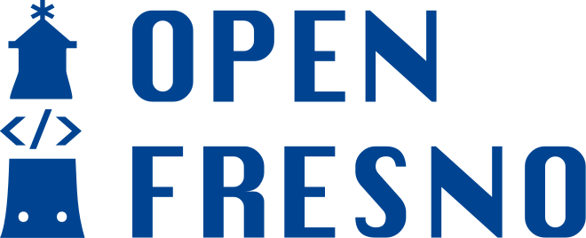

<h1>

</h1>
 

**Open Fresno** is a platform for civic innovation. As an open-source organization, you can fork our code including our website. Help us make a project better by [forking it](https://help.github.com/articles/fork-a-repo/), adding new content or features, and [submitting a pull request](https://help.github.com/articles/creating-a-pull-request/)!

- [Projects](https://openfresno.org/projects)
- [Getting started guide](https://openfresno.github.io/fe-openfresno-doc/?path=/docs/get-started--docs)

## Contributing

If you're looking for a starter development task to get your feet wet with our codebase, any of our discussions tagged [help wanted](https://github.com/openfresno/fe-openfresno-doc/discussions?discussions_q=is%3Aopen+label%3A%22help+wanted%22) might be a good fit.

Some of the other Issues are larger and require some deeper design or architectural work; if one of those catches your eye, you'll probably want to talk with us for some more context and background. Either comment on the Issue or — even better — catch up with us at one of [Open Fresno's bi-weekly Hack Nights](https://www.meetup.com/openfresno/).

## Other resources

- [Open Fresno website documentation](https://github.com/openfresno/fe-openfresno-doc)
- [Open Websites Figma](https://www.figma.com/design/attWQWKwed1XSaaaMuzM5m/Open-Websites?node-id=2612-11351&t=IiJjmX4Zr0KPPUyE-0)
